# Architecture

## System Diagram

```mermaid
graph TB
    subgraph Client["Browser (React 19 + Next.js 15)"]
        UI["form-and-results.tsx<br/>Tool selection form"]
        Anim["animated-results-sequence.tsx<br/>GSAP reveal animations"]
        PDF["generate-pdf-report.ts<br/>jsPDF client-side export"]
        LS["storage-utils.ts<br/>localStorage persistence"]
    end

    subgraph Engine["Optimization Engine (lib/)"]
        OE["optimization-engine.ts<br/>1 077 LOC deterministic rules"]
    end

    subgraph API["Next.js API Routes (app/api/)"]
        AuditAPI["/api/audit-summary<br/>POST — Gemini summary"]
        LeadsAPI["/api/leads<br/>POST — lead capture"]
        FeedbackAPI["/api/feedback<br/>POST — star ratings"]
        SharesAPI["/api/shares<br/>POST — shareable link"]
    end

    subgraph Services["External Services"]
        Gemini["Google Gemini 2.5 Flash<br/>generativelanguage.googleapis.com"]
        Supa["Supabase<br/>Postgres (leads table)"]
        Resend["Resend<br/>Transactional email"]
    end

    subgraph Infra["Infrastructure"]
        Vercel["Vercel Edge Network<br/>Serverless Functions"]
        LocalFS["data/*.json<br/>Local file fallback"]
    end

    UI -->|"tool configs + team size"| OE
    OE -->|"OptimizationResult JSON"| UI
    UI -->|"result payload"| AuditAPI
    AuditAPI -->|"prompt"| Gemini
    Gemini -->|"executive summary"| AuditAPI
    AuditAPI -->|"summary text"| UI
    UI --> Anim
    UI --> PDF
    UI --> LS
    UI -->|"email + savings"| LeadsAPI
    LeadsAPI --> Supa
    LeadsAPI --> Resend
    LeadsAPI --> LocalFS
    UI -->|"score 1-5"| FeedbackAPI
    FeedbackAPI --> LocalFS
    UI -->|"tool configs"| SharesAPI
    SharesAPI --> LocalFS
    Vercel -.->|"hosts"| Client
    Vercel -.->|"runs"| API

    classDef client fill:#667eea22,stroke:#667eea,stroke-width:2px
    classDef engine fill:#f093fb22,stroke:#f093fb,stroke-width:2px
    classDef api fill:#1f9e7522,stroke:#1f9e75,stroke-width:2px
    classDef ext fill:#e24b4a22,stroke:#e24b4a,stroke-width:2px
    classDef infra fill:#66666622,stroke:#888,stroke-width:1px,stroke-dasharray: 5 5

    class UI,Anim,PDF,LS client
    class OE engine
    class AuditAPI,LeadsAPI,FeedbackAPI,SharesAPI api
    class Gemini,Supa,Resend ext
    class Vercel,LocalFS infra
```



---

## Data Flow: User Input → Audit Result

The journey from a user's first click to a fully rendered audit takes **three phases** — two entirely client-side and one server-side:

```
┌──────────────────────────────────────────────────────────────────────┐
│  PHASE 1 — INPUT  (client)                                         │
│                                                                     │
│  1. User selects tools (Cursor, Copilot, Claude, ChatGPT, Gemini)  │
│  2. For each tool → picks plan tier + enters seat count + spend    │
│  3. Sets team size and primary use-case (coding/writing/data/…)    │
│  4. Form state auto-saved to localStorage via storage-utils.ts     │
└──────────────────────────┬───────────────────────────────────────────┘
                           │ ToolConfig[] + teamSize + useCase
                           ▼
┌──────────────────────────────────────────────────────────────────────┐
│  PHASE 2 — DETERMINISTIC AUDIT  (client, zero network)             │
│                                                                     │
│  optimization-engine.ts runs six check passes sequentially:         │
│                                                                     │
│   ① Plan-floor checks (Claude Team <5 seats, Cursor Biz <10)      │
│   ② Pricing-mismatch detection (spend vs. expected list price)     │
│   ③ Cross-tool redundancy (Cursor+Copilot, Claude+ChatGPT)        │
│   ④ Token-optimization for API-direct plans (>$200/mo)             │
│   ⑤ Pricing-fit questions (4 evaluators: right plan? cheaper       │
│      same-vendor? cheaper alt? retail vs credits?)                  │
│   ⑥ Waste-score calculation (30% overspend + 40% redundancy       │
│      + 30% unused = composite 0-100%)                              │
│                                                                     │
│  Output → OptimizationResult {                                      │
│    recommendations[], pricingFitAnswers[],                          │
│    totalMonthlySavings, wasteScore, wasteCategory, …                │
│  }                                                                  │
└──────────────────────────┬───────────────────────────────────────────┘
                           │ OptimizationResult JSON
                           ▼
┌──────────────────────────────────────────────────────────────────────┐
│  PHASE 3 — AI ENRICHMENT + PRESENTATION  (server + client)         │
│                                                                     │
│  1. Client POSTs result to /api/audit-summary                      │
│  2. Rate limiter checks IP (10 req/min sliding window)             │
│  3. Route builds a structured prompt and calls Gemini 2.5 Flash    │
│     (primary key → secondary key → template fallback)              │
│  4. AI-generated executive summary returned to client               │
│  5. GSAP stagger-animates waste score, savings cards,               │
│     recommendations, and summary onto the page                     │
│  6. User can export a branded PDF (jsPDF, client-side)             │
│  7. User can submit lead form → /api/leads → Supabase + Resend    │
│  8. User can share config → /api/shares → short ID link            │
└──────────────────────────────────────────────────────────────────────┘
```

### Key design choice

The audit engine is **fully deterministic and runs in the browser**. The Gemini call only generates a natural-language summary on top of results that are already computed. This means:
- Audits work offline / without API keys (summary falls back to a template).
- Results are reproducible and testable with Jest (no LLM non-determinism in the critical path).
- Latency is dominated by the Gemini round-trip (~1-3 s), not by the audit logic itself.

---

## Why This Stack

| Layer | Choice | Why |
|---|---|---|
| **Framework** | Next.js 15 (App Router) | File-based routing, API routes co-located with pages, React Server Components for fast initial paint, seamless Vercel deployment. |
| **Language** | TypeScript | Strict types enforce the `OptimizationResult` contract between engine ↔ UI ↔ API; catches pricing-tier typos at compile time. |
| **Audit Engine** | Vanilla TS (no ML, no LLM) | Deterministic business rules are auditable, testable, and free to run. An LLM-based engine would be non-reproducible and expensive at scale. |
| **LLM** | Google Gemini 2.5 Flash | Cheapest high-quality model for summarisation; dual-key failover keeps uptime high; template fallback ensures zero-downtime even if both keys fail. |
| **Styling** | Tailwind CSS 3.4 + CSS Modules | Tailwind for rapid utility-first layout; CSS Modules (`credex.module.css`) for complex component-scoped animations and glassmorphism effects. |
| **Animations** | GSAP 3.15 | Hardware-accelerated timeline control for the staggered results reveal; smoother than CSS `@keyframes` for sequenced multi-element orchestration. |
| **PDF Export** | jsPDF (client-side) | No server resources consumed; report generates instantly in the browser with branded colours, tables, and metric cards. |
| **Lead Storage** | Supabase (Postgres) → local JSON fallback | Supabase gives a managed database with row-level security and a generous free tier. The local-JSON fallback keeps the app functional when Supabase keys aren't configured (dev / CI). |
| **Email** | Resend | Simple transactional API, generous free tier (100 emails/day), built for developer workflows. |
| **Rate Limiting** | In-memory sliding window (`rate-limiter.ts`) | Zero dependencies; sufficient for single-instance Vercel deployments. Cleans up stale entries every 10 minutes to prevent memory leaks. |
| **Testing** | Jest + ts-jest | Fast unit tests for the deterministic engine; no browser required. Covers plan-floor rules, pricing mismatch, cross-tool overlap, and waste-score maths. |
| **Hosting** | Vercel | Zero-config Next.js deployment, edge CDN, automatic HTTPS, preview deploys on every PR. |

---

## What I'd Change for 10k Audits/Day

At ~10 000 audits per day (~7 req/min sustained, with spikes to 50+ req/min), the current architecture hits three bottlenecks: rate limiting, LLM cost, and data persistence. Here's the scaling roadmap:

### 1. Move Rate Limiting Out of Process Memory

The current `Map<string, RateLimitTracker>` lives in a single serverless function instance. At scale, each cold-start gets a fresh map, making limits ineffective.

**Change →** Replace with **Upstash Redis** (serverless, per-request billing):
```
isAllowed(ip) → INCR rate:audit:{ip} EX 60
```
Redis survives across function instances and gives globally consistent rate limits.

### 2. Cache Gemini Summaries

At 10k audits/day × ~$0.00015/call, Gemini costs are modest (~$1.50/day), but latency matters. Many audits with similar tool stacks produce near-identical summaries.

**Change →** Hash the `OptimizationResult` into a cache key and store the generated summary in **Redis with a 1-hour TTL**. Cache-hit rate should be 30-50% because tool/plan/seat combinations are finite.

### 3. Replace Local JSON Files with a Real Database

`data/leads.json` and `data/shares.json` are append-only JSON files written to the Vercel filesystem, which is **ephemeral** on serverless. Supabase is already integrated but only for leads.

**Change →** Move **all persistence** (leads, feedback, shares) to Supabase tables with proper indexes:
```sql
CREATE TABLE shares (id TEXT PRIMARY KEY, tools JSONB, created_at TIMESTAMPTZ);
CREATE TABLE feedback (id SERIAL, score INT, created_at TIMESTAMPTZ);
CREATE INDEX idx_shares_created ON shares(created_at);
```

### 4. Add a Job Queue for Email

Resend calls inside the request handler block the response. At 10k leads/day, email failures or latency would degrade audit response times.

**Change →** Push email payloads to an **async queue** (Vercel Cron + Supabase `email_queue` table, or Inngest). A background worker drains the queue every 30 seconds.

### 5. Pre-compute Pricing Data

The `TOOL_PLAN_PRICING` constant is hardcoded. Updating prices requires a code deploy.

**Change →** Move pricing data to a **Supabase `pricing` table** with an admin UI. Cache in Redis with a 15-minute TTL. This decouples pricing updates from code deploys and lets non-engineers update rates.

### 6. Observability

**Change →** Add structured logging (Axiom or Vercel Log Drains) and basic metrics:
- Audit count per hour
- Gemini cache hit rate
- P95 audit latency
- Lead conversion rate (audit → lead form submit)

### Summary at Scale

| Concern | Current (MVP) | At 10k/day |
|---|---|---|
| Rate limiting | In-memory `Map` | Upstash Redis |
| LLM summaries | Direct Gemini call | Redis-cached summaries (1h TTL) |
| Data storage | Local JSON files | Supabase Postgres for all entities |
| Email | Synchronous Resend call | Async job queue |
| Pricing data | Hardcoded TS constant | Database table + admin UI |
| Monitoring | `console.log` | Structured logs + dashboards |

The core audit engine itself (**Phase 2**) scales trivially — it's a pure function with O(n²) tool-pair comparison where n ≤ 5. It could handle 100k audits/day on a single Lambda without any changes.
