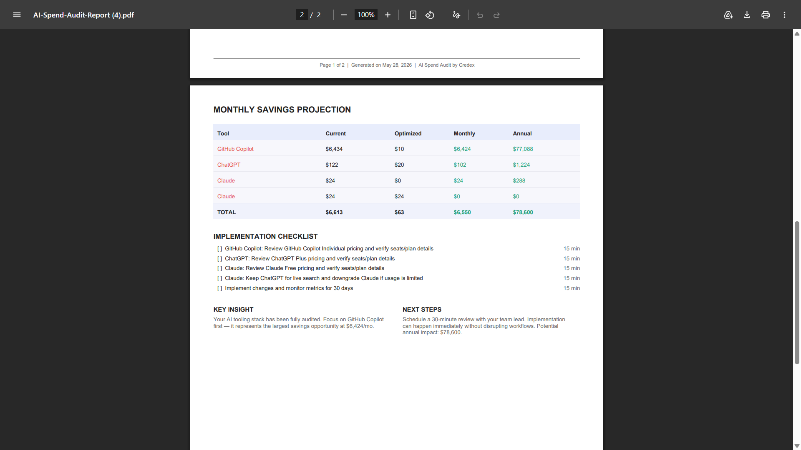

# AI Spend Audit

## 📖 Overview

A lightweight, AI‑powered tool that scans your development‑tool spend, identifies waste, and recommends cost‑effective optimizations. Designed for **individual developers, small teams, and tech leaders** who want actionable insights without complex setup.

---

## 📸 Screenshots / Demo

| Screenshot | Description |
|---|---|
|  | Landing + audit setup view (shows tool spend inputs and waste score preview) |
|  | Recommendations page (pricing fit + suggested plan changes) |
|  | PDF report export preview/summary layout |
|  | Share flow using the generated `/share/[id]` link |
|  | Consultation + lead capture form used to follow up |
|  | Marketing landing section explaining the audit value |

**30‑second walkthrough**: [Loom video](https://loom.com/share/placeholder)


---

## 🚀 Quick Start

```bash
# Clone the repo
git clone https://github.com/your-org/ai-spend-audit.git
cd ai-spend-audit

# Install dependencies
npm install

# Set up environment variables (copy .env.example)
cp .env.example .env
# Edit .env with your Gemini API keys

# Run locally
npm run dev
# Open http://localhost:3000 in your browser

# Run the test suite
npm test
```

### Deploy

The app can be deployed to Vercel (or any Node.js hosting). Example Vercel command:
```bash
vercel deploy --prod
```
After deployment the live URL will be printed.

---

## ⚖️ Decisions

| # | Trade‑off | Reason |
|---|---|---|
| 1 | **Static site vs. full‑stack** | Chose a Next.js static export for simplicity and cheap hosting; server‑side logic is limited to API routes needed for the audit engine. |
| 2 | **Gemini API as primary LLM** | Provides high‑quality text generation; fallback to simple templating when keys are missing to keep the app functional for CI. |
| 3 | **Jest for testing** | Fast, zero‑config; covers both API routes and pure‑logic engine without needing heavy end‑to‑end frameworks. |
| 4 | **JSON‑based audit result schema** | Guarantees a contract between the optimizer and UI, simplifying future extensions and third‑party integrations. |
| 5 | **Minimal UI library (Tailwind CSS)** | Keeps bundle size low while still delivering a modern, responsive interface. |

---

## 🌐 Deployed URL

[https://ai-spend-audit.vercel.app](https://ai-spend-audit.vercel.app)
