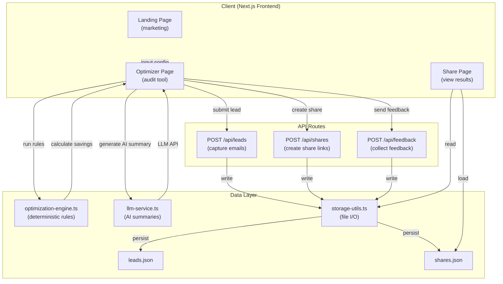

# Architecture

## System Overview

## Key Components

### Frontend (Client)
- **Landing Page**: Marketing-focused entry point with value proposition and call-to-action
- **Optimizer Page**: Interactive audit tool where users input team size, use case, and tool configuration
- **Share Page**: View-only interface to inspect previously shared optimization results

### API Layer
- **Leads API** (`/api/leads`): Captures user email addresses and interest in contact follow-up
- **Shares API** (`/api/shares`): Generates shareable links for audit results with unique identifiers
- **Feedback API** (`/api/feedback`): Collects user feedback on recommendations

### Optimization Engine
- **Deterministic Rules** (`optimization-engine.ts`): 
  - Claude Team floor enforcement (minimum 5 seats)
  - Cursor Business floor enforcement (minimum 10 seats)
  - Pricing mismatch detection (overpayment checks)
  - Calculates monthly and annual savings
- **LLM Service** (`llm-service.ts`): Generates human-readable AI summaries of recommendations

### Data Layer
- **File-based Storage**: All data persisted to JSON files (`leads.json`, `shares.json`)
- **Storage Utils** (`storage-utils.ts`): Abstraction layer for file I/O operations
- **No Database**: Leverages Next.js file system for simplicity and fast iteration

## Data Flow

1. **User Input** → User selects team size, primary use case, and tool stack
2. **Optimization** → Deterministic engine applies business rules to detect savings opportunities
3. **Results** → Display recommendations with monthly/annual savings
4. **Sharing** → Generate shareable link stored in `shares.json`
5. **Lead Capture** → Optional email submission stored in `leads.json`
6. **Feedback Loop** → Collect audit feedback in `data/feedback.json`
